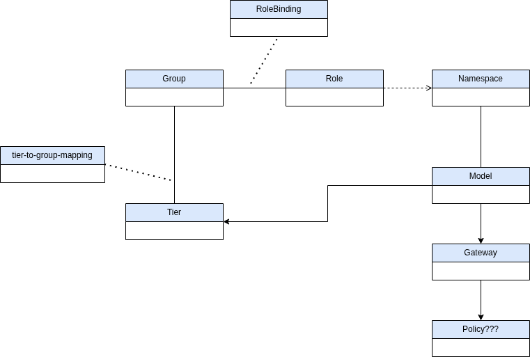

# maas-experiments

Opinionated experiments and deployment manifests for running MAAS-backed (Model-as-a-Service) clusters and sample apps.

This repository contains kustomize manifests, example machine sets, app definitions and helper tooling used to provision and test model serving applications on clusters managed through MAAS and Kubernetes.

Preview
-------

The diagram below shows the high-level MAAS + Kubernetes domain model used by these experiments.




Contents
--------

- `clusters/` — cluster-level kustomize or application overlays (example cluster configs and app-of-apps entries).
	- `ocpai3-aws/` — example cluster/app overlays for an environment named `ocpai3-aws`.
	- `appofapps-repository-config.yaml` — sample repo config for ArgoCD App-of-Apps pattern.
- `components/` — reusable kustomize bases representing apps and platform components.
	- `apps/platform/maas/base/` — platform-level manifests for MAAS integration (RBAC, tier-to-group mappings, etc).
	- `apps/machine-set/base/` — machine set manifests (e.g., `4xlarge-machine-set.yaml`) used to request nodes.
	- `apps/model1` and `apps/model2` — sample model inference application manifests.
	- `apps/users/` — htpasswd and kustomize base for test users.
- `images/` — (intended) images or references used by the manifests (may be empty / placeholder).
- `tools/` — helper scripts. For example: `tools/bootstrap-cluster.sh`.

Goals
-----

- Provide a quick, repeatable way to stand up sample workloads that demonstrate MAAS + Kubernetes provisioning.
- Host example kustomize bases and overlays that can be used with ArgoCD or manual `kubectl apply -k` flows.
- Keep manifests small and easy to adapt for different instance types or clusters.

Prerequisites
-------------

- MAAS (Metal-as-a-Service) environment accessible and configured (API endpoint + credentials).
- A Kubernetes control plane capable of registering/bootstrapping nodes from MAAS (e.g., MetalLB + bootstrapping tooling, or an existing cluster management system that integrates MAAS). This repo focuses on manifests, not the MAAS server itself.
- `kubectl` and `kustomize` installed locally. If using ArgoCD, ArgoCD configured to point at this repo.
- (Optional) `jq`, `yq` for quick manifest edits.

Quickstart — local steps
------------------------

The repository provides a helper script at `tools/bootstrap-cluster.sh` to automate some bootstrap steps. The exact behavior of that script depends on your environment — inspect it before running.

Minimal manual flow (example):

1. Inspect the cluster overlay you intend to use:

```bash
# from repo root
ls clusters/ocpai3-aws
cat clusters/appofapps-repository-config.yaml
```

2. Inspect platform and machine-set bases to adapt to your environment:

```bash
# review machine-set and platform manifests
sed -n '1,200p' components/apps/machine-set/base/4xlarge-machine-set.yaml
sed -n '1,200p' components/apps/platform/maas/base/kustomization.yaml
```

3. Deploy a target base (example using kustomize):

```bash
# apply MAAS platform base
kubectl apply -k components/apps/platform/maas/base

# apply a machine-set (requests nodes) — CAUTION: this will try to create machine resources
kubectl apply -k components/apps/machine-set/base

# apply an example model app
kubectl apply -k components/apps/model1/base
kubectl apply -k components/apps/model2/base
```

4. (Optional) Use the bootstrap script to automate the above where appropriate:

```bash
chmod +x tools/bootstrap-cluster.sh
./tools/bootstrap-cluster.sh
```

Repository layout (more detail)
------------------------------

- clusters/
	- Cluster-specific overlays and example ArgoCD app-of-apps repository configuration.

- components/apps/platform/maas/base/
	- `kustomization.yaml` configures platform-level resources required for the MAAS integration — RBAC, mappings, and any CRDs.

- components/apps/machine-set/base/
	- MachineSet-like manifests describing machine classes (for kube-machine-api or other machine controller).

- components/apps/model1 & model2
	- Example LLM inference kustomize bases (lightweight examples showing how to wire an inference service into the platform).

- components/apps/users/
	- `users.htpasswd` for basic test authentication and a small kustomize base to create secrets.

- tools/
	- Helper shell utilities (bootstrap and other convenience scripts). Inspect them before execution.

Configuration points you will likely change
-----------------------------------------

- Machine sizes and flavor: `components/apps/machine-set/base/4xlarge-machine-set.yaml`
- Service images: `components/apps/model1/base/llm-inference.yaml` and model2 equivalent.
- User accounts: `components/apps/users/users.htpasswd` and the kustomize base.
- Cluster overlays: `clusters/ocpai3-aws/*` for cluster-scoped differences.

Using ArgoCD
------------

This repository includes an example `appofapps-repository-config.yaml` under `clusters/` designed for an App-of-Apps ArgoCD pattern.

- Create an ArgoCD App pointing to `clusters/<overlay>` to let Argo manage the lifecycle.
- Ensure ArgoCD has permissions to create and manage the resources defined in the platform base (RBAC in `components/apps/platform/maas/base/rbac.yaml`).

Development notes and recommendations
-----------------------------------

- Keep small, focused kustomize bases for each logical unit (platform, machine-set, model). Compose via overlays.
- When changing machine/instance types, only update `components/apps/machine-set/base` and the relevant overlay in `clusters/`.
- Prefer immutable image tags in manifests (avoid `:latest` for reproducibility).

Troubleshooting
---------------

- Nothing gets scheduled after machine-set applied: ensure kubelet/provisioning on newly provisioned nodes is healthy and node objects join the cluster.
- RBAC or permission denied errors: inspect `components/apps/platform/maas/base/rbac.yaml` and adjust the cluster role bindings for ArgoCD or the agent applying manifests.
- App not reachable: check Service/Ingress and any MetalLB or load-balancer implementation. For bare-metal, you need a load-balancing solution or an ingress controller that can work with your network.

Safety and cautions
-------------------

- Some manifests (machine-set) will instruct cluster provisioning systems to create real nodes or allocate resources in MAAS — ensure you understand any cost or capacity implications in your environment before applying.
- Inspect `tools/bootstrap-cluster.sh` and any scripts before running them. They may perform privileged operations.

Contributing
------------

Contributions are welcome. Suggested workflow:

1. Fork and create a feature branch.
2. Add small, focused changes to kustomize bases or overlays.
3. Include short documentation in the related manifest folder describing what changed and why.

License
-------

This repository does not include a license file. Add a LICENSE if you want to allow reuse. If you want me to add a recommended license (MIT, Apache-2.0, etc.), tell me which one.

Contact / next steps
--------------------

If you want, I can:

- add a minimal CI job to validate kustomize builds for each overlay,
- add a `Makefile` with common operations (apply, delete, diff),
- or add an example `argocd` application manifest to demonstrate the App-of-Apps flow.

If you'd like any of those, tell me which and I'll implement it.

-----

Generated by repository scan on 2025-12-01.

